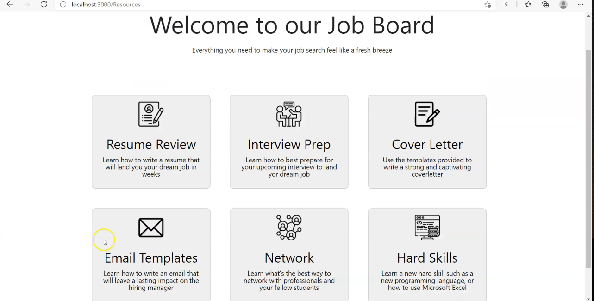

# job_board-resources_page

The images on the reources page might not load properly due to a slow internet connection. But when you combine it with the rest of the web application which was delopyed on heroku before the resources pages was merged and it should look like this:
  
  

  
  

For the job board to work, follow the following steps:
  
(1) Download the jobs folder
  
(2) Open command line on your computer
  
(3) Using cd navigate to where the jobs folder is
  
(4) Type in cd jobs
  
(5) Type in npm start
  
Note: The job board was created using Github Jobs API, and by following the following YouTube tutorial:
https://www.youtube.com/watch?v=fxY1q4SCB64&list=WL&index=110&t=470s

